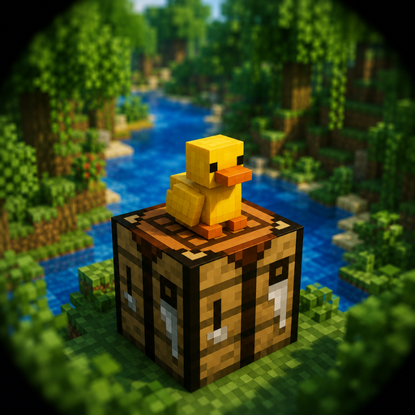

<H1 align="center">🦆 DuckCraft Launcher</H1>



[](https://github.com/uyen11a1-star/duckcraft-launcher-mojo/actions)
[](./LICENSE)

**DuckCraft Launcher** is a Minecraft: Java Edition launcher for Android, letting you play Minecraft Java Edition right on your phone or tablet.

This is a personal fork maintained by **nguyenquochuy**, built on top of [MojoLauncher](https://github.com/MojoLauncher/MojoLauncher) — an actively maintained successor of [PojavLauncher](https://github.com/PojavLauncherTeam/PojavLauncher) (the original project was archived in September 2025).

## Table of Contents
- [Introduction](#introduction)
- [What's different from vanilla MojoLauncher](#whats-different-from-vanilla-mojolauncher)
- [Download](#download)
- [Building from source](#building-from-source)
- [Known Issues](#known-issues)
- [License](#license)
- [Third party components, licenses and sources (when applicable)](#third-party-components-licenses-and-sources-when-applicable)

## Introduction
* Runs almost every Minecraft version, from very old builds (rd-132211) to the latest snapshots.
* Supports modding via Forge and Fabric.
* Lets you install modloaders and mods (like [OptiFine](https://optifine.net)) directly from `.jar` installers.

## What's different from vanilla MojoLauncher
- 🦆 Rebranded: new name, icon, and a **yellow-green** color theme.
- 🖼️ Added the **MobileGlues** renderer — better performance on many Android devices, alongside the existing Holy GL4ES, Zink (Vulkan), Freedreno, and LTW options.
- 📦 Added an in-app **Mod / Resource Pack browser & downloader** powered by Modrinth — search and install directly into your active instance without leaving the app.

## Download
- Latest builds: check the [Actions](https://github.com/uyen11a1-star/duckcraft-launcher-mojo/actions) tab → pick the latest ✅ run → download from the Artifacts section.

## Building from source
```
./gradlew :app_pojavlauncher:assembleDebug
```
(Use `.\gradlew.bat` instead of `./gradlew` on Windows.)

> Note: compiling native code (renderers, JNI) requires an x86_64 host (e.g. GitHub Actions). It cannot be built directly on an Android/Termux device due to official Android NDK's host architecture limitations.

## Known Issues
- Some physical mice may have unusually slow cursor speed.
- On Holy GL4ES, large texture atlases may appear distorted (affects some modpacks).
- The mod search results aren't filtered by mod loader (Fabric/Forge/Quilt) yet — double-check compatibility before installing.

## License
- DuckCraft Launcher is licensed under [GNU LGPLv3](./LICENSE), inherited from MojoLauncher and PojavLauncher.

## Third party components, licenses and sources (when applicable)
- [MojoLauncher](https://github.com/MojoLauncher/MojoLauncher): [GNU LGPLv3 License](https://github.com/MojoLauncher/MojoLauncher/blob/v3_openjdk/LICENSE)
- [PojavLauncher](https://github.com/PojavLauncherTeam/PojavLauncher): [GNU LGPLv3 License](https://github.com/PojavLauncherTeam/PojavLauncher/blob/v3_openjdk/LICENSE)
- [MobileGlues](https://github.com/MobileGL-Dev/MobileGlues-release): see license at the source repo.
- [Boardwalk](https://github.com/zhuowei/Boardwalk) (JVM Launcher): Unknown License/[Apache License 2.0](https://github.com/zhuowei/Boardwalk/blob/master/LICENSE) or GNU GPLv2.
- Android Support Libraries: [Apache License 2.0](https://android.googlesource.com/platform/prebuilts/maven_repo/android/+/master/NOTICE.txt).
- [Holy GL4ES](https://github.com/artdeell/gl4es_extra_extra/): [MIT License](https://github.com/ptitSeb/gl4es/blob/master/LICENSE).
- [OpenJDK](https://github.com/PojavLauncherTeam/openjdk-multiarch-jdk8u): [GNU GPLv2 License](https://openjdk.java.net/legal/gplv2+ce.html).
- [GLFW](https://github.com/MojoLauncher/glfw): [zlib license](https://github.com/MojoLauncher/glfw/blob/glfw34/LICENSE.md)
- [LWJGL2-GLFW](https://github.com/MojoLauncher/lwjgl2-glfw): 3-Clause BSD license
- [LWJGL3](https://github.com/LWJGL/lwjgl3): [BSD-3 License](https://github.com/LWJGL/lwjgl3/blob/master/LICENSE.md).
- [Mesa 3D Graphics Library](https://gitlab.freedesktop.org/mesa/mesa): [MIT License](https://docs.mesa3d.org/license.html).
- [pro-grade](https://github.com/pro-grade/pro-grade): [Apache License 2.0](https://github.com/pro-grade/pro-grade/blob/master/LICENSE.txt).
- [bhook](https://github.com/bytedance/bhook): [MIT license](https://github.com/bytedance/bhook/blob/main/LICENSE).
- [Authlib-Injector](https://github.com/yushijinhun/authlib-injector): [AGPL-3.0](https://github.com/yushijinhun/authlib-injector/blob/develop/LICENSE).
- [alsoft](https://github.com/kcat/openal-soft/): [GNU LIBRARY GENERAL PUBLIC LICENSE](https://github.com/kcat/openal-soft/blob/master/COPYING) and [modified PFFFT](https://github.com/kcat/openal-soft/blob/master/LICENSE-pffft).
- [oboe](https://github.com/google/oboe): [Apache License 2.0](https://github.com/google/oboe/blob/main/LICENSE).
- Thanks to [Mineskin](https://mineskin.eu/) for providing Minecraft avatars.
